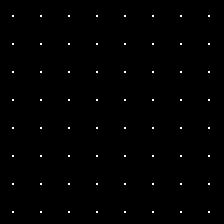
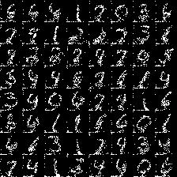
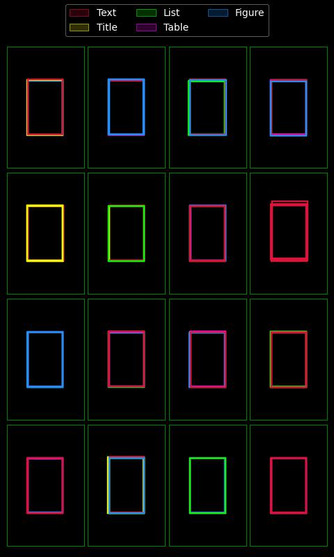
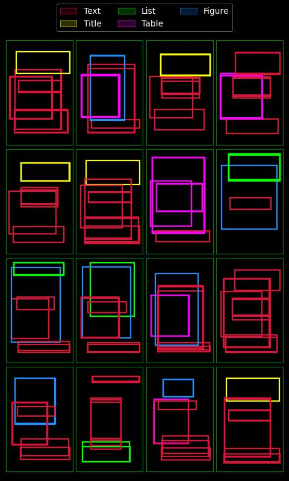

## Steps to run the code:

\
**File: LayoutGAN_Mnist.ipynb**

Download it to your local PC or upload it to the Google Colab. You can use any tool which supports notebook (.ipynb) files.

Download the **mnist_data.npy** file from the link[ \[link\]](https://drive.google.com/file/d/1ffXQBgM3Z64k2bVnJ7iOtzdVcqFVI4X3/view?usp=share_link).

Perform below steps to modify the code according your environment:

1. Update the sample_dir variable with the path to the folder where you want to store the result images.

2. Update the dataset_path variable with the path where you stored mnist_data.npy file.

3. Run the LayoutGAN_Mnist.ipynb from the beginning.

4. Prediction will be stored in the sample_dir folder.
   

    

        
        
Image at epoch 0

    

    

        
        
Image at epoch 50

    

\
\
**File: LayoutGAN_PubLayNet.ipynb**

Download it to your local PC or upload it to the Google Colab. You can use any tool which supports notebook (.ipynb) files.

Download the **sorted_c1publay.npy** file from the link[ \[link\]](https://drive.google.com/file/d/1lZP7ozePW9UuRv9sFkxGEeybDRe1XIJT/view?usp=share_link).

Perform below steps to modify the code according your environment:

1. Update the sample_dir variable with the path to the folder where you want to store the result images.

2. Update the dataset_path variable with the path where you stored sorted_c1publay.npy file.

3. Run the LayoutGAN_PubLayNet.ipynb file from the beginning.

4. Prediction will be stored in the sample_dir folder.

  

GPU is preferred, but not necessary. Machine with GPU can perform the training faster compared to non-GPU machines.

    

        
        
Image at epoch 0

    

    

        
        
Image at epoch 50

    

